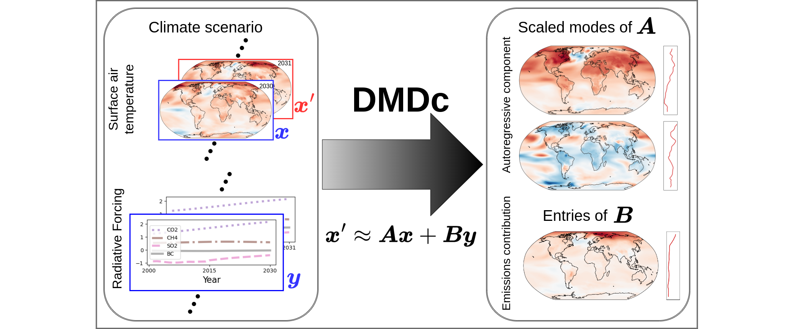

# Analyzing Climate Scenarios Using Dynamic Mode Decomposition With Control

## Abstract
Understanding the complex dynamics of climate patterns under different anthropogenic emission scenarios is crucial for predicting future environmental conditions and formulating sustainable policies. Using Dynamic Mode Decomposition with control (DMDc), we analyze surface air temperature patterns from climate simulations to elucidate the effects of various climate-forcing agents. This improves upon previous DMD-based methods by including forcing information as a control variable. Our study identifies both common climate patterns, like the North Atlantic Oscillation and El Ni{\~n}o Southern Oscillation, and distinct impacts of aerosol and carbon emissions. We show that these emissions' effects vary with climate scenarios, particularly under conditions of higher radiative forcing. Our findings confirm DMDc's utility in climate analysis, highlighting its role in extracting modes of variability from surface air temperature while controlling for emissions contributions and exposing trends in these spatial patterns as forcing scenarios change.This study applies dynamic mode decomposition with control (DMDc) to assess temperature and precipitation variability in climate model projections under various future shared socioeconomic pathways (SSPs). We leverage global greenhouse gas emissions and local aerosol emissions as control parameters to unveil nuanced insights into climate dynamics.Our approach involves fitting distinct DMDc models over a high-ambition/low-forcing scenario (SSP126), a medium-forcing scenario (SSP245) and a high-forcing scenario (SSP585). By scrutinizing the eigenvalues and dynamic modes of each DMDc model, we uncover crucial patterns and trends that extend beyond traditional climate analysis methods. Preliminary findings reveal that temporal modes effectively highlight variations in global warming trends under different emissions scenarios. Moreover, the spatial modes generated by DMDc offer a refined understanding of temperature disparities across latitudes, effectively capturing large-scale oscillations such as the El Niño Southern Oscillation. The proposed data-driven analytical framework not only enriches our comprehension of climate dynamics but also enhances our ability to anticipate and adapt to the multifaceted impacts of climate change. Integrating DMDc into climate scenario analysis may help formulate more effective strategies for mitigation and adaptation.

### References
* Watson‐Parris, Duncan, et al. "ClimateBench v1. 0: A benchmark for data‐driven climate projections." Journal of Advances in Modeling Earth Systems 14.10 (2022): e2021MS002954.
* Proctor, Joshua L., Steven L. Brunton, and J. Nathan Kutz. "Dynamic mode decomposition with control." SIAM Journal on Applied Dynamical Systems 15.1 (2016): 142-161.
* Demo, Nicola, Marco Tezzele, and Gianluigi Rozza. "PyDMD: Python dynamic mode decomposition." Journal of Open Source Software 3.22 (2018): 530.

## Organization
* ./build_models -- fitting DMD models on the data
* ./models/ -- where we save the fitted models
* autoregressive_component.ipynb -- plots for autoregressive component
* forcing_contribution.ipynb -- plots for forcing contribution
* concept_plots.ipynb -- plots for climate bench data and regions

## Authors
Nathan Mankovich, 
